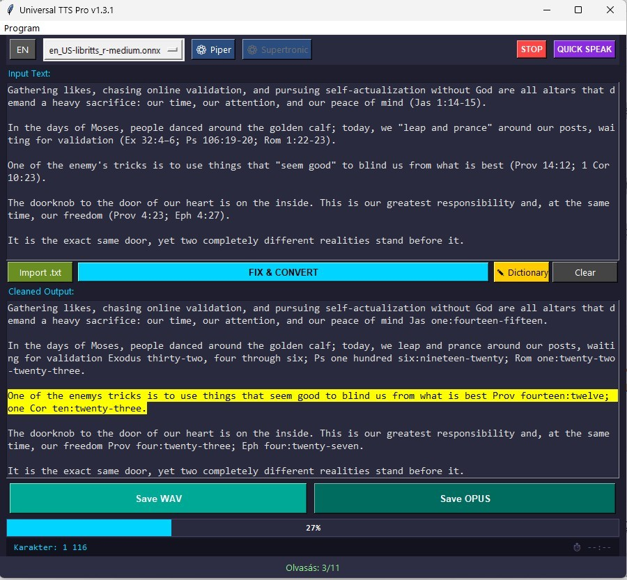
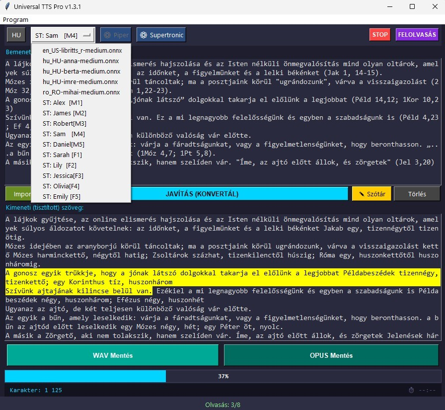
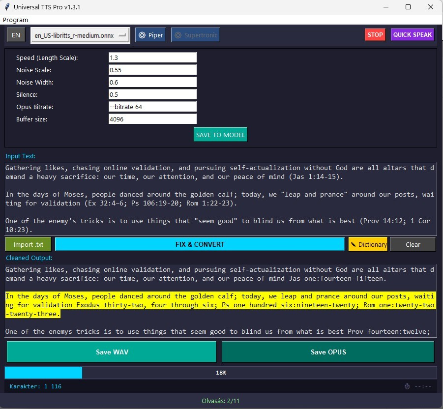
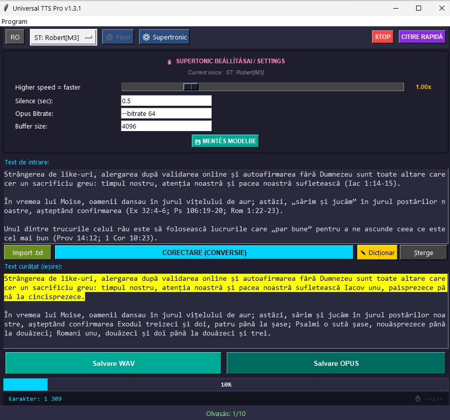

# Universal TTS Pro - v1.3.1

A portable, fully offline Text-to-Speech (TTS) client built with Python and Tkinter. This application combines the power of **Piper TTS** and **Supertonic TTS** engines to deliver high-quality, lightning-fast speech synthesis directly on your device, without requiring an internet connection, cloud services, or external API keys.

---

## 🌟 Key Features & Smart Capabilities

* **100% Offline & Private:** All processing happens locally on your machine. Your data never leaves your device.
* **Dual TTS Engine Architecture:**
  * **Piper TTS:** High-quality, neural text-to-speech utilizing optimized ONNX models.
  * **Supertonic TTS:** Extremely fast, lightweight, on-device multilingual speech engine.
* **Intelligent Text Normalization (FIX Button):**
  * Automatically expands common abbreviations and correctly formats **Bible verses**.
  * Advanced number-to-words conversion supporting **Hungarian (HU), English (EN), and Romanian (RO)**!
  * Allows raw conversion without text correction via the *Output* section.
* **Click-to-Jump Navigation:** Click on any sentence inside the text area while speech is active to instantly skip or resume playback from that exact point.
* **Instant Smart STOP:** Pressing STOP instantly kills both the audio playback AND the background file generation process.
* **Flexible Audio Outputs:** Export speech to studio-quality **WAV** or space-efficient, high-fidelity **OPUS** files.

---

## 💻 System Requirements

Since **Universal TTS Pro** runs entirely offline and processes neural AI speech models locally on your hardware, your system should meet the following minimum specifications:

| Component | Minimum Requirement | Recommended Specification |
| :--- | :--- | :--- |
| **Operating System** | Windows 10 / 11 (64-bit) | Windows 10 / 11 (64-bit) |
| **Processor (CPU)** | Intel Core i3 / AMD Ryzen 3 (Dual-Core) | Intel Core i5 / AMD Ryzen 5 or better (Quad-Core+) |
| **Memory (RAM)** | 4 GB RAM | 16 GB RAM or more |
| **Storage Space** | ~100 MB (Client + Tools) | Up to 2-5 GB (Depending on downloaded `.onnx` voices) |
| **Audio** | Any standard Windows-compatible sound card / output device |

### ℹ️ Hardware Performance Note:
* **CPU-Bound:** The speech synthesis process relies heavily on your processor's single-core and multi-core performance.
* **Generation Speed:** On recommended hardware, text generation is faster than real-time (the audio is ready almost instantly). On older or lower-end dual-core processors, you might experience a brief 1-3 second delay before the playback starts while the engine pre-renders the first sentences.

---

## 🛠️ Tech Stack & Open-Source Credits

This project is built upon incredible open-source technologies, respecting all their corresponding licensing terms:

* **Voice Engine (Piper):** [Sherpa-ONNX Runtime](https://github.com/k2-fsa/sherpa-onnx) by k2-fsa / Next-gen Kaldi — **Apache 2.0 License**
* **Voice Models (Piper):** Community-contributed models from Mozilla Common Voice & [rhasspy/piper-voices](https://huggingface.co/rhasspy/piper-voices) — **MIT** (repo-level; individual model licenses in MODEL_CARD)
* **Voice Engine (Supertonic):** [Supertonic TTS 3](https://github.com/supertone-inc/supertonic) by Supertone Inc. — **MIT License** (code) / **OpenRAIL-M** (model weights)
* **Audio Playback:** [SoundDevice](https://python-sounddevice.readthedocs.io/) (PortAudio) by Matthias Geier — **MIT License**
* **Numerical Processing:** [NumPy](https://numpy.org/) — **BSD 3-Clause License**
* **Audio Compression:** [Opus Tools (opusenc)](https://gitlab.xiph.org/xiph/opus-tools) by Xiph.Org Foundation — **BSD 3-Clause License**
* **GUI Framework:** Tkinter — **Python Software Foundation (PSF) License**
* **Development Assistance:** AI-assisted software engineering.

---

## 🚀 Getting the Application

### ✅ Option 1 — Ready-to-Use Portable Package (Recommended)

**No installation, no compilation needed.**

Download the fully pre-compiled, portable ZIP from the [**Releases**](https://github.com/szabiz/Universal-TTS-pro/releases) section. The package contains everything required to run the application immediately:

* The compiled `UniversalTTS_Pro.exe`
* All required Opus binaries (`opusenc.exe`)
* Default Piper voice models (HU / EN / RO)
* Supertonic 3 model weights
* Language normalization dictionaries

Simply extract the ZIP to any folder or USB drive and run `UniversalTTS_Pro.exe`.

---

### 🔧 Option 2 — Build from Source (Developers)

The files in this GitHub repository represent the **raw source code only**. The repository intentionally does **not** include binary tools or large model files.

To compile a working executable from source, you must manually obtain and place the following components before running PyInstaller:

#### Required components not included in this repository:

| Component | Where to get it | Place it in |
| :--- | :--- | :--- |
| `opusenc.exe` | [opus-codec.org](https://opus-codec.org/downloads/) or [GitLab](https://gitlab.xiph.org/xiph/opus-tools) | Root folder |
| Piper voice models (`.onnx`) | [rhasspy/piper-voices](https://huggingface.co/rhasspy/piper-voices) | `models/` folder |
| Supertonic 3 weights | [Supertone/supertonic-3](https://huggingface.co/Supertone/supertonic-3) | `models/supertonic3/` folder |

#### Python dependencies:
```bash
pip install sherpa-onnx sounddevice numpy supertonic
```

#### Build command:
```bash
build_UniversalTTS_Pro.bat
```

> **Note:** The `UniversalTTS_Pro.spec` file contains the full PyInstaller configuration. Adjust paths if your folder structure differs.

---

## 📂 Repository Structure

### 📁 Source Repository (this GitHub repo)

```text
Universal-TTS-pro/
│
├── UniversalTTS_pro.py           # Main Python source code
├── UniversalTTS_Pro.spec         # PyInstaller build configuration
├── build_UniversalTTS_Pro.bat    # Automated build script
├── LICENSE                       # MIT License
├── README.md                     # This documentation
├── javitasok_HU.txt              # Hungarian normalization dictionary
├── javitasok_EN.txt              # English normalization dictionary
├── javitasok_RO.txt              # Romanian normalization dictionary
├── UTTsp_0.jpg                   # Screenshot — Main interface
├── UTTsp_1.jpg                   # Screenshot — Voice models
├── UTTsp_2.jpg                   # Screenshot — Piper settings
└── UTTsp_3.jpg                   # Screenshot — Supertonic settings
```

> ⚠️ **The following components are NOT included in the repository** and must be added manually before building, or are included in the compiled release package:
> `opusenc.exe`, `.onnx` voice models, Supertonic 3 model weights.

---

### 📦 Compiled Portable Package (from Releases)

```text
UniversalTTS_Pro_v1.3.1_Portable/
│
├── UniversalTTS_Pro.exe          # Compiled executable (PyInstaller)
│
├── _internal/                    # PyInstaller runtime bundle (auto-generated)
│   ├── opusenc.exe               # Opus encoder          (BSD 3-Clause)
│   ├── javitasok_HU.txt          # Hungarian normalization dictionary
│   ├── javitasok_EN.txt          # English normalization dictionary
│   ├── javitasok_RO.txt          # Romanian normalization dictionary
│   ├── sherpa_onnx/              # Sherpa-ONNX runtime   (Apache 2.0)
│   ├── onnxruntime/              # ONNX Runtime          (MIT)
│   ├── numpy/                    # NumPy                 (BSD 3-Clause)
│   ├── PIL/                      # Pillow                (HPND License)
│   ├── _sounddevice_data/        # SoundDevice / PortAudio (MIT)
│   ├── _tcl_data/                # Tcl/Tk                (BSD-style)
│   ├── _tk_data/                 # Tkinter               (PSF)
│   ├── python3.dll               # Python runtime        (PSF)
│   ├── python314.dll             # Python runtime        (PSF)
│   └── [other PyInstaller runtime files]
│
models/                            # Voice model files
│   ├── hu_HU-berta-medium.onnx    # Hungarian voice — Berta   (MIT / CC0)
│   ├── hu_HU-berta-medium.onnx.json
│   ├── hu_HU-berta-medium.onnx.tokens
│   ├── hu_HU-anna-medium.onnx     # Hungarian voice — Anna    (MIT / CC0)
│   ├── hu_HU-anna-medium.onnx.json
│   ├── hu_HU-anna-medium.onnx.tokens
│   ├── hu_HU-imre-medium.onnx     # Hungarian voice — Imre    (MIT / CC0)
│   ├── hu_HU-imre-medium.onnx.json
│   ├── hu_HU-imre-medium.onnx.tokens
│   ├── en_US-libritts_r-medium.onnx  # English voice — LibriTTS-R (CC BY 4.0)
│   ├── en_US-libritts_r-medium.onnx.json
│   ├── en_US-libritts_r-medium.onnx.tokens
│   ├── ro_RO-mihai-medium.onnx    # Romanian voice — Mihai    (MIT / CC0)
│   ├── ro_RO-mihai-medium.onnx.json
│   ├── ro_RO-mihai-medium.onnx.token
│   └── supertonic3/                # Supertonic 3 weights  (OpenRAIL-M)
```

---

## 📄 Third-Party Licenses

Universal TTS Pro is built entirely on open-source components. The following section provides a complete overview of all third-party dependencies, their authors, and their applicable licenses. Full license texts are available at the linked repositories.

---

### 🔧 Runtime Libraries & Tools

| Component | Author / Organization | License | Source |
| :--- | :--- | :--- | :--- |
| **Sherpa-ONNX** (Piper runtime) | k2-fsa / Next-gen Kaldi | Apache License 2.0 | [GitHub](https://github.com/k2-fsa/sherpa-onnx) |
| **Piper TTS** (voice engine) | Michael Hansen / Rhasspy | MIT License | [GitHub](https://github.com/rhasspy/piper) |
| **espeak-ng** (Text-to-phoneme data) | espeak-ng contributors | GNU GPL v3.0 | [GitHub](https://github.com/espeak-ng/espeak-ng) |
| **Supertonic 3** (runtime code) | Supertone Inc. | MIT License | [GitHub](https://github.com/supertone-inc/supertonic) |
| **Supertonic 3** (model weights) | Supertone Inc. | OpenRAIL-M License | [Hugging Face](https://huggingface.co/Supertone/supertonic-3) |
| **opusenc** (Opus encoder) | Xiph.Org Foundation | BSD 3-Clause License | [GitLab](https://gitlab.xiph.org/xiph/opus-tools) |
| **SoundDevice** | Matthias Geier | MIT License | [GitHub](https://github.com/spatialaudio/python-sounddevice) |
| **PortAudio** (SoundDevice dependency) | Ross Bencina & Phil Burk | MIT License | [Website](http://www.portaudio.com/) |
| **NumPy** | NumPy Contributors | BSD 3-Clause License | [GitHub](https://github.com/numpy/numpy) |
| **Python / Tkinter** | Python Software Foundation | PSF License | [python.org](https://www.python.org/) |

---

### 🎙️ Voice Models — Piper (`rhasspy/piper-voices`)

All Piper voice models are distributed via the [`rhasspy/piper-voices`](https://huggingface.co/rhasspy/piper-voices) repository on Hugging Face (repository-level license: **MIT**). Each individual model contains its own `MODEL_CARD` file specifying dataset-level licensing terms.

#### Default Models (included in Releases package)

| Voice | Language | Model ID | Repo License | Dataset License | Model Card |
| :--- | :--- | :--- | :--- | :--- | :--- |
| **Anna** | Hungarian (hu_HU) | `hu_HU-anna-medium` | MIT | **CC0** (Public Domain) | [MODEL_CARD](https://huggingface.co/rhasspy/piper-voices/tree/main/hu/hu_HU/anna/medium) |
| **Imre** | Hungarian (hu_HU) | `hu_HU-imre-medium` | MIT | **CC0** (Public Domain) | [MODEL_CARD](https://huggingface.co/rhasspy/piper-voices/tree/main/hu/hu_HU/imre/medium) |
| **Berta** | Hungarian (hu_HU) | `hu_HU-berta-medium` | MIT | **CC0** (Public Domain) | [MODEL_CARD](https://huggingface.co/rhasspy/piper-voices/tree/main/hu/hu_HU/berta/medium) |
| **LibriTTS-R** | English (en_US) | `en_US-libritts_r-medium` | MIT | **CC BY 4.0** | [MODEL_CARD](https://huggingface.co/rhasspy/piper-voices/tree/main/en/en_US/libritts_r/medium) |
| **Mihai** | Romanian (ro_RO) | `ro_RO-mihai-medium` | MIT | **CC0** (Public Domain) | [MODEL_CARD](https://huggingface.co/rhasspy/piper-voices/tree/main/ro/ro_RO/mihai/medium) |

> **Note:** Voice models may have been trained on datasets with their own upstream licensing terms. The `MODEL_CARD` file for each voice is the authoritative source for dataset-level attribution. Always review it before commercial deployment.

---

### ℹ️ License Notes

- **Blizzard/Lessac Research License** *(en_US-lessac-medium dataset):* ⚠️ This is the most restrictive license in the project. The original Lessac/Blizzard 2013 dataset is licensed for **non-commercial, research use only**. Commercial use, including the development or distribution of voice synthesis products, is explicitly excluded. If you intend to distribute Universal TTS Pro commercially, consider replacing the Lessac model with a CC0 or CC-BY licensed English voice (e.g., `en_US-libritts-high` or `en_US-ryan-medium`).

- **OpenRAIL-M** *(Supertonic 3 model weights):* This is **not** equivalent to a standard MIT or BSD license. It permits both personal and commercial use, but includes behavioral use restrictions — prohibiting use for impersonation without consent, harassment, or other harmful purposes. An attribution requirement also applies. Read the [full OpenRAIL-M license text](https://huggingface.co/Supertone/supertonic-3/blob/main/LICENSE) before deployment in any commercial or public-facing product.

- - **CC BY 4.0** *(en_US-libritts_r-medium dataset):* This model is fully compatible with commercial use. The only requirement is proper attribution. The project complies with this by providing the OpenSLR 141 source citation in this documentation.

- **Apache 2.0** *(Sherpa-ONNX):* Requires preservation of copyright notices and the `NOTICE` file when redistributing. Compatible with most commercial and open-source uses.

- **BSD 3-Clause** *(Opus Tools, NumPy):* Requires retention of copyright notice and disclaimer in documentation when redistributing. Commercial use is freely permitted.

- **MIT** *(Piper, Supertonic code, SoundDevice, PortAudio, piper-voices repo):* Highly permissive. Commercial and private use, modification, and redistribution are freely permitted with attribution.

- **PSF License** *(Python / Tkinter):* Compatible with commercial use. Attribution required.

- **GNU GPL v3.0** *(espeak-ng-data):* This is a copyleft license. Because the portable package includes espeak-ng data for phonetic conversion, the combined distribution is subject to GPLv3 terms, requiring open-source availability. Since the Universal TTS Pro source code is freely available under the MIT license on GitHub, this requirement is naturally fulfilled.

Universal TTS Pro itself is released under the **MIT License** — see the [`LICENSE`](./LICENSE) file for details.

---

## 📖 USER GUIDE (v1.3 PORTABLE)

### 1. Text Input & Hotkeys
* **Copy/Paste:** Standard `Ctrl+C` / `Ctrl+V` or Right-click context menu.
* **Importing:** Load `.txt` files directly using the **'Import .txt'** gomb / button.

### 2. Fix & Convert
* Click the blue **FIX** button to prepare text for speech (expands abbreviations, processes Bible citations, and converts numbers to words).
* If you wish to convert text without applying linguistic corrections, bypass the fix step and use the *Output* section options directly.

### 3. Find & Replace
* Use the built-in **Find & Replace** tool to search for any word, phrase, or character sequence within the loaded text.
* Instantly replace single occurrences or all matches at once — ideal for correcting recurring words, names, or abbreviations before synthesis.

### 4. Portable Mode (USB Drive Execution)
The software is fully optimized to run portably. To deploy on a USB drive:
1. Download the compiled package from the [**Releases**](https://github.com/szabiz/Universal-TTS-pro/releases) section.
2. Extract the ZIP to any folder on your desktop, laptop, or USB flash drive.
3. Run `UniversalTTS_Pro.exe` directly — no installation required.

---

### Screenshots








